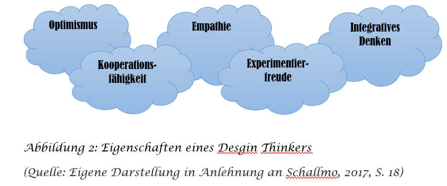

[Hier ist mein Professor](https://ulrich-anders.eu/)

1.Einleitung

Make the human element as important as the technical & business elements. Dies ist der zentrale Grundgedanke einer Kreativtechnik, die es ermöglicht, vielschichtige Fragestellungen zu lösen. Das sogenannte Design Thinking ist ein lösungsorientierter Innovationprozess, dessen Ziel es ist die Bedürfnisse von Menschen zu eruieren, Herausforderungen anzunehmen und durch Kreativtechniken eine innovative Lösung zu finden. Der fortschreitende Innovationsgedanke ist in den meisten Unternehmen angekommen und das entstandene Bewusstsein, in Team-Prozessen nach Lösungen zu suchen, ist Grundgedanke des Design Thinking (Schallmo, 2017, S. 13).
Der detaillierte Ablauf ist vielen jedoch nicht bekannt. Der Frage, was im Einzelnen passiert, wird in dieser Arbeit nachgegangen. 
Das Verfahren hat in den letzten Jahren an Relevanz gewonnen, da die Schnelligkeit von Innovationszyklen zunimmt. Die Bedürfnisse der Menschen werden spezieller und daher wird es für Unternehmen schwieriger, mit Produkten oder Dienstleistungen diese zu befriedigen. Aufgrund der Digitalisierung und den internationalen Einflüssen fließen Trends in die Kaufentscheidungen mit ein und Probleme werden zunehmend komplexer. Die Herausforderung, den hybriden Konsumenten einzuschätzen kann beispielsweise durch Expertenurteile geschehen. Das Risiko einer falschen Prognose ist jedoch immer möglich (Grots und Pratschke, 2009, S. 18, 19).

2.Definition

Entstanden ist das Design Thinking in den USA an der Standford University in Kalifornien. Nach Weiterentwicklungen fand der Ansatz seinen Weg nach Deutschland. 
Der Grundgedanke und gleichzeitig auch das Besondere am Design Thinking ist es, sich von der Expertenperspektive zu distanzieren und hin zu Kundenperspektive bzw. Nutzerperspektive zu gelangen. Die zweite Phase des Prozesses, der Beobachtung, wird daher die größte Bedeutung zugeschrieben. Beim Design Thinking werden weniger analytische Prozesse genutzt, es geht eher um die Bedürfnisse des Kunden und die praktische Relevanz der erarbeiteten Ergebnisse. 
Die Kreativtechnik ist zudem ein iterativer Prozess. Dies bedeutet, dass Schritte wiederholt werden können und das Vor- und Zurückspringen zwischen den Phasen erlaubt ist, wenn etwas übersehen wurde.  Dies hat vor allem den Vorteil der Kosten- und Zeitersparnis, da das Modifizieren am Ende eines Projektes einen großen Aufwand erfordert. Fehler müssen zugelassen und als Gewinn gesehen werden. Das hilft, Potenziale zu identifizieren und Bereiche der Optimierung zu finden. Insgesamt kann Design Thinking als eine Art Innovations-Katalysator gesehen werden (Gürtler und Meyer, 2013, S. 14, 17). 

3.Der Prozess

Insgesamt besteht der Prozess aus zwei Betrachtungsräumen. Die Problemdefinition, die Beobachtung und die Einsicht gehören zu dem Problemraum, indem das Problem identifiziert wird. Die darauffolgende Ideenfindung, die Gestaltung eines Prototyps und der Test gehören in den Lösungsraum, indem eine innovative Lösung entwickelt wird. Der tatsächliche Bedarf des Kunden wird im ersten Raum ermittelt. Dies ist die Basis für den gesamten innovativen Prozess, denn je mehr Zeit und Aufwand in diesem Raum investiert wird, desto besser wirkt sich dies auf die Erarbeitung und Ergebnisse im Lösungsraum aus. Eine grundlegende Hilfe die Kreativität zu fördern ist ein geeigneter „Team Space“, das bedeutet flexible Räumlichkeiten, in denen sich die Teammitglieder wohlfühlen und die sie frei gestalten können (Gürtler und Meyer, 2013, S. 20, 21).

In der folgenden Abbildung wird der Design-Thinking-Prozess dargestellt:
  

3.1.Phase Ⅰ: Problem definieren und verstehen 

In der ersten Phase des Design-Thinking-Prozesses wird zunächst die relevante Frage bzw. das Problem erarbeitet. Es wird geklärt, welchen Kunden es betrifft. Die Bedürfnisse einer Persona müssen eruiert werden. Um den Gesamtkontext zu verstehen und das Problem zu definieren hilft es, die W-Fragen heranzuziehen (Wer, Warum, Was, Wann, Wo, Wie) (Leifer, Lewrick, und Link, 2018, S. 40). 
Die Wahrscheinlichkeit ist hoch, dass in der nächsten Phase in die erste zurückgesprungen wird, da dort eine Masse an Erkenntnissen generiert wird und das Weiterführen des Prozesses nicht effektiv wäre. Behauptungen müssen hier hinterfragt werden. Abduktives Denken hilft dabei, Gedanken zuzulassen und offen gegenüber anderen Meinungen und Einstellungen zu sein. Das ist der erste Schritt um innovativ zu sein. Daher ist es wichtig in interdisziplinären Teams zu arbeiten. Heterogene Teammitglieder sind von hoher Bedeutung, da eine höhere Breite an Ideen sichergestellt werden kann. Kreativität und Vielfalt werden gefördert (Schallmo, 2017, S. 16, 17).

3.2.Phase Ⅱ: Beobachten    

In der dritten Phase geht es hauptsächlich darum, so viele Erkenntnisse wie möglich zu gewinnen. Das Verfahren, welches bei der Beobachtung angewendet wird ist das „Shadowing“. Die deutsche Übersetzung, „Beschattung“, impliziert, dass ein Kunde verdeckt beobachtet wird. Neben dieser explorativen Methode finden auch andere Verfahren Anwendung, wie Tiefeninterviews, Befragungen oder teilnehmende Beobachtungen. Es ist effektiv, mehrere Methoden durchzuführen und miteinander zu verknüpfen (Schallmo, 2017, S. 70, 71). 
Das kontinuierliche Dokumentieren und Visualisieren ist von Vorteil um im Nachgang den Teammitgliedern die Ergebnisse darzulegen. Diese Phase weist in der Grafik (siehe Abbildung 1), sowie auch praktisch die größte Bedeutung auf. Ziel ist es, möglichst viele Erkenntnisse zu generieren, indem die Nutzerperspektive genutzt wird. Ausschlaggebend ist es, Empathie zu zeigen und auf den Kunden einzugehen. Zusätzliche Hilfe bei der anschließenden Untersuchung bringen Informationen aus dem relevanten Markt, sowie bereits vorhandene Forschungen (Leifer, Lewrick, und Link, 2018, S. 41).

3.3.Phase Ⅲ: Einsicht    

Nach der eigentlichen Forschung werden nun Einblicke geschaffen. Dies sollte auf Meta-Ebene geschehen, ein neuer, innovativer Blickwinkel auf Herausforderung und Beobachtung. Die Gestaltung durch heterogene Teammitglieder wird in dieser Phase erneut relevant. Die Einsicht wird durch verschiedene Denkweisen, Wahrnehmungen und Wissen des diversen Teams bereichert. Basiswissen soll hier geschaffen werden (Leifer, Lewrick, und Link, 2018, S. 41). In der Phase wird die Persona und dessen Profil weiterentwickelt. Diese Persona steht repräsentativ für den Kunden und zeigt dessen persönlichen Hintergründe, Interessen, Werte, Bedürfnisse und Ängste. 

3.4.Phase Ⅳ: Ideenfindung  

 Nachdem der Problemraum abgeschlossen wurde, beginnt mit der Phase der Ideenfindung der Lösungsraum. Da alle Teammitglieder in den Prozess einbezogen werden, kann jeder einzelne als Experte gesehen werden. In der Phase werden Ideen zusammengetragen und Lösungsansätze besprochen. Es gilt die Regel: Je mehr desto besser. Die gängigste Methode ist das Brainstorming oder die Skizzenanfertigung. Das Sortieren der Ideen kann durch das Clustern von Themen vereinfacht werden. Fehler werden akzeptiert, alle Ideen werden zugelassen und Ansätze werden sukzessiv bearbeitet. Gemeinschaftlich folgen eine Abstimmung und eine Entscheidung für eine Idee bzw. einen Ansatz Leifer, Lewrick, und Link, 2018, S. 41, 98). 

3.5.Phase Ⅴ: Prototyp  

Im Design Thinking wird mit den Händen gedacht. Daher wird in der fünften Phase ein Prototyp erstellt. Die Idee soll wahrnehmbar bzw. tastbar sein, um Konstrukte besser zu verstehen. Die Erstellung des Prototyps läuft schnell ab, um diesen zeitnah testen zu können und wichtiges Feedback zu erhalten. Nur so können Ideen oder Prototypen verbessert werden und wiederholt getestet werden. Beispiele für ein Prototyp sind eine Collage oder eine technische Konstruktion. Treten Probleme bei dem Test auf, müssen die Phasen iterativ wiederholt werden. Das Motto dieser Phase lautet: Love it, change it or leave it (Leifer, Lewrick, und Link, 2018, S. 42).

3.6.Phase Ⅵ: Test   

Wenn der Prototyp die optimale Lösung darstellt und der Test erfolgreich abgeschlossen wurde, kann dieser am realen potenziellen Nutzer bzw. Kunden getestet werden. Der Test stellt dann einen Erfolg dar, wenn der Prototyp marktfähig und nutzergerecht ist. Die Innovation sollte im Bestfall die Kundenbedürfnisse komplett befriedigen (Grots und Pratschke, 2009, S. 22).

4.Anwendungsbereiche

Der Design-Thinking-Prozess fand ursprünglich Anwendung in der Produktentwicklung. Es hat sich jedoch gezeigt, dass die Technik überall Anwendung findet, wo Lösungen durch eine Kreativtechnik gesucht werden. Dies kann beispielsweise bei Geschäftsmodellentwicklungen der Fall sein. Durch den Innovationsprozess können zudem Management- und Unternehmensstrategien entwickelt werden. Es bietet sich die Chance, Fehler zu akzeptieren und diese als Gewinn zu sehen. Eine positive Auswirkung auf die Motivation ist eine anzunehmende Folge. Anwendungen des Design-Thinking-Prozesses aus der Praxis zeigen, dass Bausteine einer Idee schon bei einer tieferen Beschäftigung mit dem Problemraum mit enthalten sind. Eine positive Auswirkung in der Praxis ist außerdem eine Erhöhung der Wettbewerbsfähigkeit auf dem Markt.
Das Design Thinking weist auch Grenzen auf. Der Prozess kann nicht als „Wunderserum“ für jedes Problem gesehen werden. Es kann durchaus der Fall sein, dass keine Lösung gefunden wird. Dies gilt es zu akzeptieren. Die Wahrscheinlichkeit, die Bedürfnisse erfolgreich zu eruieren, wird trotz dessen erhöht, da die Chance, ein komplexes Problem zu lösen erhöht ist (López, 2019, S. 2, 4.) 

In der folgenden Abbildung werden zusammenfassend die nötigen Eigenschaften eines Design Thinkers gezeigt:

   
5.Fazit

Unternehmen müssen lernen, einen neuen Blickwinkel auf Fragestellungen und Erkenntnisse zu entwickeln. Neue Wege werden durch das Design Thinking beschritten und ungewöhnliche Ideen müssen im selben Maße betrachtet werden wie die gewöhnlichen. Design Thinking bedeutet auch, visuell zu arbeiten. Dies heißt Ideen und Ansätze bildhaft darzustellen um dessen Verständnis zu erhöhen. Kollaboratives Arbeiten steht beim Design Thinking ebenso im Mittelpunkt wie der Perspektivenwechsel zum Nutzer. Der Fokus des Design-Thinking-Prozesses liegt in der Eruierung der Kundenbedürfnisse, um dessen Wünsche zu verstehen und den Nutzen für die Kunden vollkommen auszuschöpfen. Menschen werden individueller betrachtet und die Bedürfnisse werden spezieller. Darauf müssen Unternehmen reagieren und auch neue Wege gehen !

6.Literaturverzeichnis

Grots, A. und Pratschke, M. (2009). Design Thinking. Kreativität als Methode. Marketing Review St. Gallen. 2, S. 18-23.

Gürtler, J. und Meyer, J. (2013). 30 Minuten Design Thinking. Offenbach: GABAL Verlag. 

Leifer, L., Lewrick, M. und Link, P. (2018). Das Design Thinking Playbook. Mit traditionellen, aktuellen und zukünftigen Erfolgsfaktoren (2. Auflage). München: Valen Verlag.

López, I. (2019). Innovationsmanagement. Design Thinking: Neue Lösungen für komplexe Herausforderungen. Dokumentation + Kommunikation, S.1-5.

Schallmo, D.R.A. (2017). Design Thinking erfolgreich anwenden. So entwickeln Sie in 7 Phasen kundenorientierte Produkte und Dienstleistungen. Ulm: Springer Gabler Verlag.

